# Design Document: AI-Powered Decision Support and Market-Access Platform for Indian Farmers

## Overview

This document outlines the design for a comprehensive AI-powered platform that empowers Indian farmers with data-driven decision support, direct market access, and government scheme integration. The platform leverages location-specific historical data analysis, multi-language voice interfaces, and machine learning to provide actionable insights while promoting sustainable farming practices and eliminating intermediary dependencies.

The system architecture follows a microservices approach with cloud-native deployment, ensuring scalability, reliability, and accessibility across diverse rural connectivity conditions. Key design principles include offline-first functionality, progressive data loading, and inclusive user experience design for low-literacy users.

## Architecture

The platform employs a distributed microservices architecture with the following key components:

```mermaid
graph TB
    subgraph "Client Layer"
        MA[Mobile App]
        WA[Web App]
        VI[Voice Interface]
    end
    
    subgraph "API Gateway"
        AG[API Gateway & Load Balancer]
    end
    
    subgraph "Core Services"
        AS[Authentication Service]
        UMS[User Management Service]
        LDS[Location Data Service]
        AIS[AI Analysis Service]
        MCS[Market Connection Service]
        IRS[Input Recommendation Service]
        GSS[Government Scheme Service]
        NS[Notification Service]
    end
    
    subgraph "AI/ML Layer"
        CYP[Crop Yield Predictor]
        MPF[Market Price Forecaster]
        IRA[Input Recommendation Algorithm]
        GSM[Government Scheme Matcher]
    end
    
    subgraph "Data Layer"
        HDD[Historical Data Database]
        WDB[Weather Data Database]
        MDB[Market Data Database]
        SDB[Soil Data Database]
        UDB[User Database]
        GSD[Government Schemes Database]
    end
    
    subgraph "External APIs"
        WA_API[Weather APIs]
        MD_API[Market Data APIs]
        GS_API[Government Scheme APIs]
        SH_API[Soil Health Card APIs]
    end
    
    MA --> AG
    WA --> AG
    VI --> AG
    
    AG --> AS
    AG --> UMS
    AG --> LDS
    AG --> AIS
    AG --> MCS
    AG --> IRS
    AG --> GSS
    AG --> NS
    
    AIS --> CYP
    AIS --> MPF
    MCS --> IRA
    GSS --> GSM
    
    LDS --> HDD
    LDS --> WDB
    AIS --> MDB
    IRS --> SDB
    UMS --> UDB
    GSS --> GSD
    
    LDS --> WA_API
    MCS --> MD_API
    GSS --> GS_API
    IRS --> SH_API
```



The architecture supports horizontal scaling, fault tolerance, and efficient data caching to handle varying loads and ensure consistent performance across different network conditions.

## Components and Interfaces

### 1. Voice Interface Component

**Purpose**: Provides multilingual speech recognition and synthesis for accessibility

**Key Features**:
- Automatic Speech Recognition (ASR) for 10+ Indian languages
- Text-to-Speech (TTS) synthesis with regional accent support
- Offline voice processing capabilities for basic commands
- Voice command routing to appropriate services

**Interface**:
```typescript
interface VoiceInterface {
  recognizeSpeech(audioData: AudioBuffer, language: string): Promise<string>
  synthesizeSpeech(text: string, language: string, voice: VoiceProfile): Promise<AudioBuffer>
  processVoiceCommand(command: string, context: UserContext): Promise<ActionResult>
  getSupportedLanguages(): LanguageConfig[]
}
```

### 2. AI Analysis Service

**Purpose**: Processes historical data and generates predictive insights

**Key Features**:
- Location-specific crop yield prediction
- Market price trend forecasting
- Optimal sowing time calculation
- Risk assessment and uncertainty quantification

**Interface**:
```typescript
interface AIAnalysisService {
  analyzeCropSuitability(location: GeoLocation, soilData: SoilProfile): Promise<CropRecommendation[]>
  predictYield(cropType: string, location: GeoLocation, inputs: FarmingInputs): Promise<YieldPrediction>
  forecastPrices(cropType: string, location: GeoLocation, timeframe: TimeRange): Promise<PriceForecast>
  calculateOptimalSowing(cropType: string, location: GeoLocation): Promise<SowingRecommendation>
}
```

### 3. Market Connection Service

**Purpose**: Facilitates direct connections between farmers and buyers

**Key Features**:
- Buyer-farmer matching based on location and crop requirements
- Contract negotiation support
- Payment tracking and dispute resolution
- Quality verification and rating system

**Interface**:
```typescript
interface MarketConnectionService {
  findBuyers(cropType: string, quantity: number, location: GeoLocation): Promise<Buyer[]>
  createListing(farmerListing: CropListing): Promise<ListingResult>
  matchFarmersWithBuyers(requirements: BuyerRequirements): Promise<Match[]>
  facilitateConnection(farmerId: string, buyerId: string): Promise<ConnectionResult>
}
```

### 4. Input Recommendation Service

**Purpose**: Suggests optimal fertilizers and agricultural inputs

**Key Features**:
- Soil-specific fertilizer recommendations
- Organic input prioritization
- Chemical usage minimization algorithms
- Local supplier identification

**Interface**:
```typescript
interface InputRecommendationService {
  recommendFertilizers(soilProfile: SoilProfile, cropType: string): Promise<FertilizerRecommendation[]>
  findLocalSuppliers(location: GeoLocation, inputType: string): Promise<Supplier[]>
  optimizeInputUsage(currentInputs: Input[], targetYield: number): Promise<OptimizationResult>
  prioritizeOrganicOptions(recommendations: FertilizerRecommendation[]): Promise<FertilizerRecommendation[]>
}
```

### 5. Government Scheme Service

**Purpose**: Matches farmers with relevant government schemes and benefits

**Key Features**:
- Eligibility assessment based on farmer profile
- Application guidance and document preparation
- Scheme notification and deadline tracking
- Application status monitoring

**Interface**:
```typescript
interface GovernmentSchemeService {
  findEligibleSchemes(farmerProfile: FarmerProfile): Promise<Scheme[]>
  assessEligibility(farmerId: string, schemeId: string): Promise<EligibilityResult>
  guideApplication(schemeId: string, farmerData: FarmerData): Promise<ApplicationGuide>
  trackApplicationStatus(applicationId: string): Promise<ApplicationStatus>
}
```

## Data Models

### Core Data Structures

```typescript
// User and Location Models
interface FarmerProfile {
  id: string
  name: string
  phoneNumber: string
  location: GeoLocation
  landHoldings: LandHolding[]
  preferredLanguage: string
  literacyLevel: LiteracyLevel
  registrationDate: Date
}

interface GeoLocation {
  latitude: number
  longitude: number
  district: string
  state: string
  pincode: string
  village?: string
}

interface LandHolding {
  id: string
  area: number // in acres
  soilType: SoilType
  irrigationType: IrrigationType
  currentCrops: Crop[]
  soilHealthCardData?: SoilHealthCard
}

// Agricultural Data Models
interface SoilProfile {
  pH: number
  electricalConductivity: number
  organicCarbon: number
  nitrogen: number
  phosphorus: number
  potassium: number
  sulfur: number
  zinc: number
  copper: number
  iron: number
  manganese: number
  boron: number
  lastTested: Date
}

interface CropRecommendation {
  cropType: string
  suitabilityScore: number // 0-100
  expectedYield: YieldRange
  profitabilityIndex: number
  riskFactors: RiskFactor[]
  sowingWindow: TimeWindow
  harvestWindow: TimeWindow
  confidenceLevel: number // 0-100
}

interface YieldPrediction {
  expectedYield: number
  unit: string
  confidenceInterval: {
    lower: number
    upper: number
    confidence: number // e.g., 95%
  }
  factors: PredictionFactor[]
  uncertaintyNote: string
}

// Market and Economic Models
interface PriceForecast {
  cropType: string
  currentPrice: number
  forecastedPrices: PricePoint[]
  trendDirection: 'increasing' | 'decreasing' | 'stable'
  volatilityIndex: number
  marketFactors: MarketFactor[]
  disclaimerText: string
}

interface Buyer {
  id: string
  name: string
  type: 'company' | 'cooperative' | 'individual'
  location: GeoLocation
  requirements: CropRequirement[]
  paymentTerms: PaymentTerms
  rating: number
  verificationStatus: VerificationStatus
}

// Government Scheme Models
interface Scheme {
  id: string
  name: string
  description: string
  eligibilityCriteria: EligibilityCriteria
  benefits: Benefit[]
  applicationDeadline?: Date
  requiredDocuments: Document[]
  applicationProcess: ApplicationStep[]
  contactInformation: ContactInfo
}

interface EligibilityResult {
  isEligible: boolean
  matchedCriteria: string[]
  missingRequirements: string[]
  recommendedActions: string[]
  estimatedBenefit?: number
}
```

### Data Validation and Integrity

All data models implement comprehensive validation rules:
- Location coordinates must be within Indian geographical boundaries
- Soil parameter values must fall within scientifically valid ranges
- Price data must include timestamps and source attribution
- User inputs undergo sanitization and format validation
- Government scheme data requires official source verification

## Correctness Properties

*A property is a characteristic or behavior that should hold true across all valid executions of a system—essentially, a formal statement about what the system should do. Properties serve as the bridge between human-readable specifications and machine-verifiable correctness guarantees.*

Based on the prework analysis of acceptance criteria, the following properties ensure system correctness:

### Property 1: Location-Specific Data Consistency
*For any* valid Indian location provided by a farmer, the AI_Analyzer should retrieve and use data (crop yields, soil types, weather patterns, market prices) that is specifically tagged and relevant to that geographic location, not generic or mismatched regional data.
**Validates: Requirements 1.1, 1.2, 1.3, 1.4, 1.5**

### Property 2: Crop Recommendation Historical Basis
*For any* crop recommendation generated for a specific location, the suggested crops should have demonstrable positive historical performance data in that locality, and sowing/harvest timing should align with local weather patterns and crop-specific requirements.
**Validates: Requirements 2.1, 2.2, 2.3**

### Property 3: Uncertainty Indication Completeness
*For any* predictive output (price forecasts, yield predictions), the system should include explicit uncertainty indicators, confidence intervals, or disclaimer text stating that outputs are decision-support insights and not guaranteed predictions.
**Validates: Requirements 2.4, 2.5**

### Property 4: Geographic Proximity in Market Matching
*For any* farmer-buyer matching operation, the system should prioritize geographic proximity, ensuring that matched buyers are within reasonable transportation distance and that notifications are geographically targeted to relevant farmers.
**Validates: Requirements 3.1, 3.2, 3.4**

### Property 5: Buyer Verification Enforcement
*For any* communication or connection attempt between farmers and buyers, the system should only allow interactions with buyers who have completed the verification process and maintain accurate verification status.
**Validates: Requirements 3.3, 3.5**

### Property 6: Input Recommendation Data-Driven Basis
*For any* fertilizer or input recommendation, the suggestions should be based on both soil conditions and crop requirements, with organic options prioritized when effective, and chemical quantities minimized to effective levels.
**Validates: Requirements 4.1, 4.2, 4.3, 4.5**

### Property 7: Local Supplier Geographic Relevance
*For any* supplier recommendation request, the system should identify and suggest input suppliers within reasonable geographic proximity to the farmer's location.
**Validates: Requirements 4.4**

### Property 8: Comprehensive Multilingual Functionality
*For any* supported Indian language (Hindi, Tamil, Telugu, Bengali, Marathi, Gujarati, Kannada, Malayalam, Punjabi, Odia), all core platform functions should work correctly with accurate speech recognition, proper text rendering in appropriate scripts, and correct text-to-speech synthesis.
**Validates: Requirements 5.1, 5.2, 5.3, 5.4**

### Property 9: Government Scheme Matching Accuracy
*For any* farmer profile provided, the Government_Scheme_Matcher should identify schemes that are genuinely relevant based on the farmer's location, crop type, and profile characteristics, with complete eligibility criteria and application guidance.
**Validates: Requirements 6.1, 6.2, 6.4**

### Property 10: Targeted Scheme Notifications
*For any* new government scheme introduced, the system should notify only farmers who meet the eligibility criteria, ensuring targeted and relevant notifications.
**Validates: Requirements 6.3**

### Property 11: Government Scheme Data Currency
*For any* government scheme information displayed, the data should be current and accurate when compared to official government sources, maintaining up-to-date information on both central and state schemes.
**Validates: Requirements 6.5**

### Property 12: Data Security and Privacy Compliance
*For any* sensitive farmer data (personal information, location data), the system should implement industry-standard encryption, require explicit consent for third-party sharing, enforce access controls, and support complete data deletion within 30 days when requested.
**Validates: Requirements 7.1, 7.2, 7.3, 7.4, 7.5**

### Property 13: Performance Under Resource Constraints
*For any* platform operation under constrained conditions (2G networks, 1GB RAM devices), core functions should remain accessible with progressive loading of essential information first, offline caching of critical data, and text alternatives for all voice features.
**Validates: Requirements 8.1, 8.2, 8.3, 8.4, 8.5**

<function_calls>
<invoke name="prework">
<parameter name="featureName">farmer-decision-platform

## Error Handling

The platform implements comprehensive error handling strategies to ensure reliability and user experience:

### Network and Connectivity Errors
- **Offline Mode**: Critical features cached locally for offline access
- **Progressive Sync**: Data synchronization when connectivity is restored
- **Graceful Degradation**: Reduced functionality rather than complete failure
- **Retry Mechanisms**: Exponential backoff for transient network failures

### Data Quality and Validation Errors
- **Input Sanitization**: All user inputs validated and sanitized
- **Data Source Verification**: Multiple data sources with fallback mechanisms
- **Anomaly Detection**: Automated detection of unusual data patterns
- **User Feedback Loops**: Mechanisms for farmers to report data inaccuracies

### AI/ML Model Errors
- **Confidence Thresholds**: Recommendations only provided above confidence levels
- **Model Fallbacks**: Multiple models for critical predictions
- **Uncertainty Communication**: Clear indication of prediction reliability
- **Human Override**: Expert review for high-stakes recommendations

### Security and Privacy Errors
- **Authentication Failures**: Multi-factor authentication with account lockout
- **Data Breach Prevention**: Encryption at rest and in transit
- **Access Control**: Role-based permissions with audit logging
- **Privacy Violations**: Automated compliance checking and alerts

### User Experience Errors
- **Language Fallbacks**: Default to Hindi if preferred language unavailable
- **Voice Recognition Failures**: Text input alternatives always available
- **Interface Errors**: Clear error messages in user's preferred language
- **Help and Support**: Contextual help and human support channels

## Testing Strategy

The platform employs a comprehensive dual testing approach combining unit tests for specific scenarios and property-based tests for universal correctness validation.

### Property-Based Testing

Property-based tests validate the universal properties defined in the Correctness Properties section. Each property test will:
- Run a minimum of 100 iterations with randomized inputs
- Generate diverse test data covering edge cases and normal operations
- Reference the specific design document property being validated
- Use the tag format: **Feature: farmer-decision-platform, Property {number}: {property_text}**

**Property Test Framework**: The implementation will use Hypothesis (Python) or fast-check (TypeScript/JavaScript) for property-based testing, depending on the chosen implementation language.

**Key Property Test Categories**:
1. **Data Consistency Tests**: Validate location-specific data retrieval and usage
2. **Recommendation Quality Tests**: Verify crop and input recommendations are data-driven
3. **Geographic Proximity Tests**: Ensure distance-based matching and prioritization
4. **Multilingual Functionality Tests**: Validate language support across all features
5. **Security and Privacy Tests**: Verify encryption, access controls, and consent management
6. **Performance Tests**: Validate functionality under resource constraints

### Unit Testing

Unit tests complement property tests by focusing on:
- **Specific Examples**: Concrete scenarios with known expected outcomes
- **Edge Cases**: Boundary conditions and unusual input combinations
- **Integration Points**: Component interactions and data flow validation
- **Error Conditions**: Specific error scenarios and recovery mechanisms

**Unit Test Coverage Areas**:
- API endpoint validation with various input formats
- Database operations and data integrity
- External API integration and fallback mechanisms
- User authentication and authorization flows
- Voice interface accuracy with sample audio data
- Government scheme matching with known farmer profiles

### Integration Testing

- **End-to-End Workflows**: Complete user journeys from registration to recommendations
- **Cross-Service Communication**: Microservice interaction validation
- **External API Integration**: Third-party service integration reliability
- **Multi-Language Testing**: Full workflow testing in different Indian languages
- **Performance Testing**: Load testing under various network conditions

### Accessibility Testing

- **Voice Interface Testing**: Accuracy testing with diverse accents and dialects
- **Low-Bandwidth Testing**: Functionality validation on 2G networks
- **Device Compatibility**: Testing on basic smartphones with limited resources
- **Literacy-Friendly Testing**: Interface usability for low-literacy users

### Security Testing

- **Penetration Testing**: Security vulnerability assessment
- **Data Privacy Audits**: Compliance with Indian data protection regulations
- **Authentication Testing**: Multi-factor authentication and session management
- **Encryption Validation**: Data protection at rest and in transit

The testing strategy ensures that both individual components work correctly (unit tests) and that the system as a whole maintains its correctness properties across all possible inputs and conditions (property-based tests). This dual approach provides comprehensive coverage while maintaining development efficiency and system reliability.
